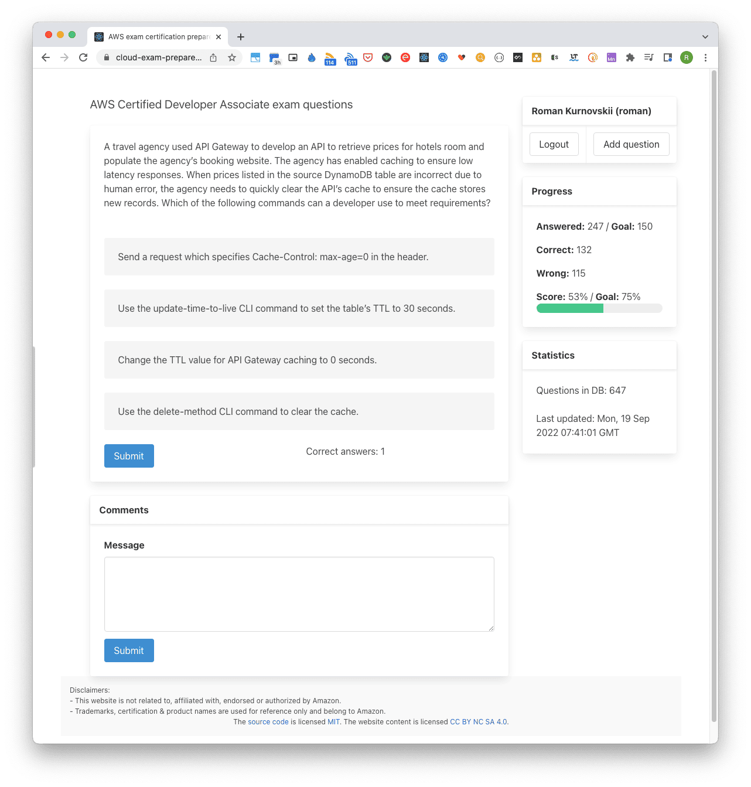

## About

AWS Certified Developer Associate exam questions 2022



Stack: 
- TypeScript
- React
- Bulma CSS
- AWS Cognito
- AWS Amplify

Project Roadmap: https://github.com/users/romankurnovskii/projects/4

## Usage

You can start it locally or place app on your site. It will work with backend as usual.

```sh
git clone https://github.com/romankurnovskii/cloud-exam-prepare.git
cd cloud-exam-prepare
npm install
```

Update `.env` if required with own AWS Cognito data or leave blank.

```
npm run start
```

## Progress

1. [Issues and Roadmap](https://github.com/users/romankurnovskii/projects/4)
1. [Initial setup with AWS Amplify](https://romankurnovskii.com/en/posts/cloud-exam-quizz/amplify-setup-project/)
1. [Setup custom domain for project](https://romankurnovskii.com/en/posts/cloud-exam-quizz/amplify-custom-domain/)
